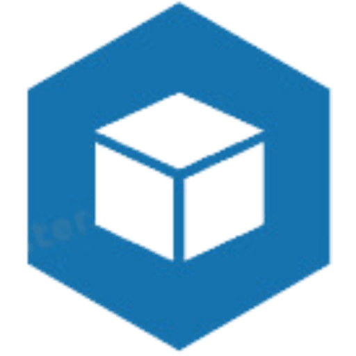

<!--
*** Thanks for checking out the Best-README-Template. If you have a suggestion
*** that would make this better, please fork the repo and create a pull request
*** or simply open an issue with the tag "enhancement".
*** Don't forget to give the project a star!
*** Thanks again! Now go create something AMAZING! :D
-->

<!-- PROJECT SHIELDS -->
<!--
*** I'm using markdown "reference style" links for readability.
*** Reference links are enclosed in brackets [ ] instead of parentheses ( ).
*** See the bottom of this document for the declaration of the reference variables
*** for contributors-url, forks-url, etc. This is an optional, concise syntax you may use.
*** https://www.markdownguide.org/basic-syntax/#reference-style-links
-->

<!-- PROJECT LOGO -->
 

  

  <h3 align="center">Sarpras Sebelas</h3>

  

    Goods management application of SMKN 11 Bandung
     
    <a href="https://github.com/Hasban-Fardani/sarpras-sebelas">View Demo</a>
    ·
    <a href="https://github.com/Hasban-Fardani/sarpras-sebelas/issues">Report Bug</a>
    ·
    <a href="https://github.com/Hasban-Fardani/sarpras-sebelas/issues">Request Feature</a>
  

<!-- TABLE OF CONTENTS -->

  
Table of Contents

  <ol>
    <li>
      <a href="#about-the-project">About The Project</a>
      <ul>
        <li><a href="#built-with">Built With</a></li>
      </ul>
    </li>
    <li>
      <a href="#getting-started">Getting Started</a>
      <ul>
        <li><a href="#prerequisites">Prerequisites</a></li>
        <li><a href="#installation">Installation</a></li>
      </ul>
    </li>
    <li><a href="#usage">Usage</a></li>
    <li><a href="#roadmap">Roadmap</a></li>
    <li><a href="#contributing">Contributing</a></li>
    <li><a href="#license">License</a></li>
    <li><a href="#contact">Contact</a></li>
    <li><a href="#acknowledgments">Acknowledgments</a></li>
  </ol>

<!-- ABOUT THE PROJECT -->
## About The Project

[![Sarpras Sebelas Screen Shot][product-screenshot]](https://sarpras-sebelas.vercel.app)

Managing goods can be difficult because they must always be checked for stock, where the goods go, and must make reports within a certain period of time to be reported to superiors. 

1. must always be checked whether it matches the stock,
2. where the goods have gone, 
3. must make reports within a certain period of time to report to superiors

(<a href="#readme-top">back to top</a>)

### Built With

- [![Vue][Vue.js]][Vue-url]
- [![Laravel][Laravel.com]][Laravel-url]

(<a href="#readme-top">back to top</a>)

<!-- GETTING STARTED -->
## Getting Started

This is an example of how you may give instructions on setting up your project locally.
To get a local copy up and running follow these simple example steps.

### Prerequisites

First 

### Installation

1. Get a free API Key at [https://example.com](https://example.com)

(<a href="#readme-top">back to top</a>)

<!-- USAGE EXAMPLES -->
## Usage

(<a href="#readme-top">back to top</a>)

<!-- ROADMAP -->
## Roadmap

- [x] 

See the [open issues](https://github.com/Hasban-Fardani/sarpras-sebelas/issues) for a full list of proposed features (and known issues).

(<a href="#readme-top">back to top</a>)

<!-- CONTACT -->
## Contact

Hasban Fardani - hasbanfardani77@gmail.com

Project Link: [https://github.com/Hasban-Fardani/sarpras-sebelas](https://github.com/Hasban-Fardani/sarpras-sebelas)

(<a href="#readme-top">back to top</a>)

<!-- ACKNOWLEDGMENTS -->
## Acknowledgments

* [Vuetify - best vue js component](https://choosealicense.com)
* [Malven's Flexbox Cheatsheet](https://flexbox.malven.co/)
* [Malven's Grid Cheatsheet](https://grid.malven.co/)
* [GitHub Pages](https://pages.github.com)

(<a href="#readme-top">back to top</a>)

<!-- MARKDOWN LINKS & IMAGES -->
<!-- https://www.markdownguide.org/basic-syntax/#reference-style-links -->
[contributors-shield]: https://img.shields.io/github/contributors/Hasban-Fardani/sarpras-sebelas.svg?style=for-the-badge
[contributors-url]: https://github.com/Hasban-Fardani/sarpras-sebelas/graphs/contributors
[forks-shield]: https://img.shields.io/github/forks/Hasban-Fardani/sarpras-sebelas.svg?style=for-the-badge
[forks-url]: https://github.com/Hasban-Fardani/sarpras-sebelas/network/members
[stars-shield]: https://img.shields.io/github/stars/Hasban-Fardani/sarpras-sebelas.svg?style=for-the-badge
[stars-url]: https://github.com/Hasban-Fardani/sarpras-sebelas/stargazers
[issues-shield]: https://img.shields.io/github/issues/Hasban-Fardani/sarpras-sebelas.svg?style=for-the-badge
[issues-url]: https://github.com/Hasban-Fardani/sarpras-sebelas/issues
[license-shield]: https://img.shields.io/github/license/Hasban-Fardani/sarpras-sebelas.svg?style=for-the-badge
[license-url]: https://github.com/Hasban-Fardani/sarpras-sebelas/blob/master/LICENSE.txt
[linkedin-shield]: https://img.shields.io/badge/-LinkedIn-black.svg?style=for-the-badge&logo=linkedin&colorB=555
[linkedin-url]: https://linkedin.com/in/othneildrew
[product-screenshot]: ./images/screenshot.png
[Next.js]: https://img.shields.io/badge/next.js-000000?style=for-the-badge&logo=nextdotjs&logoColor=white
[Next-url]: https://nextjs.org/
[React.js]: https://img.shields.io/badge/React-20232A?style=for-the-badge&logo=react&logoColor=61DAFB
[React-url]: https://reactjs.org/
[Vue.js]: https://img.shields.io/badge/Vue.js-35495E?style=for-the-badge&logo=vuedotjs&logoColor=4FC08D
[Vue-url]: https://vuejs.org/
[Angular.io]: https://img.shields.io/badge/Angular-DD0031?style=for-the-badge&logo=angular&logoColor=white
[Angular-url]: https://angular.io/
[Svelte.dev]: https://img.shields.io/badge/Svelte-4A4A55?style=for-the-badge&logo=svelte&logoColor=FF3E00
[Svelte-url]: https://svelte.dev/
[Laravel.com]: https://img.shields.io/badge/Laravel-FF2D20?style=for-the-badge&logo=laravel&logoColor=white
[Laravel-url]: https://laravel.com
[Bootstrap.com]: https://img.shields.io/badge/Bootstrap-563D7C?style=for-the-badge&logo=bootstrap&logoColor=white
[Bootstrap-url]: https://getbootstrap.com
[JQuery.com]: https://img.shields.io/badge/jQuery-0769AD?style=for-the-badge&logo=jquery&logoColor=white
[JQuery-url]: https://jquery.com 
